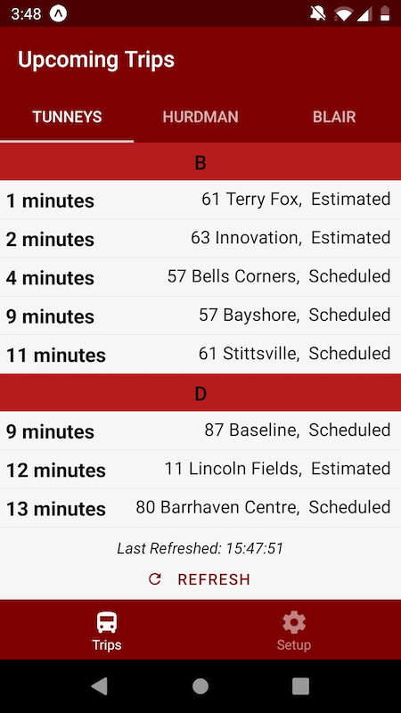
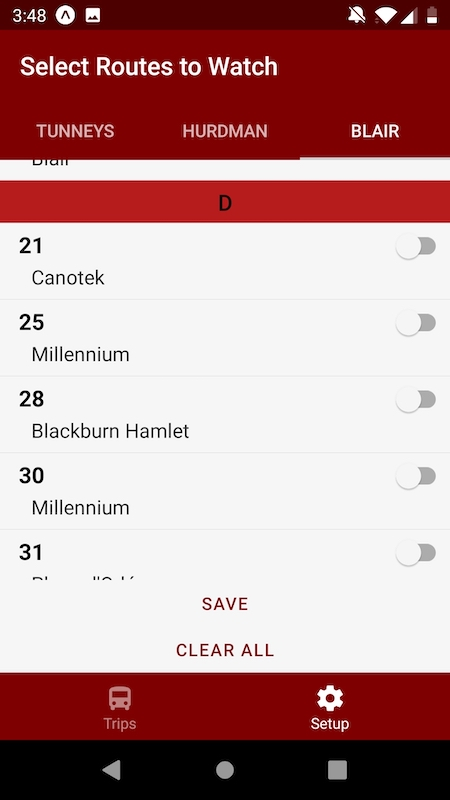

## Make transfering from the train less of a pain!

Do you have several different routes you can take at Tunney's Pasture? 
Hate seeing a bus you could have taken go by because you chose the wrong stop?
Open up OC Trainsfer just before arriving at the station, and it will
call the OC Transpo GPS feed to get the next few trips for the routes 
you've chosen to watch.

The first release is specific to Tunney's Pasture, but Hurdman and Blair are coming soon!

# See all your upcoming connections at a glance

# Easily select the routes you care about

Google Play and the Google Play logo are trademarks of Google LLC.

